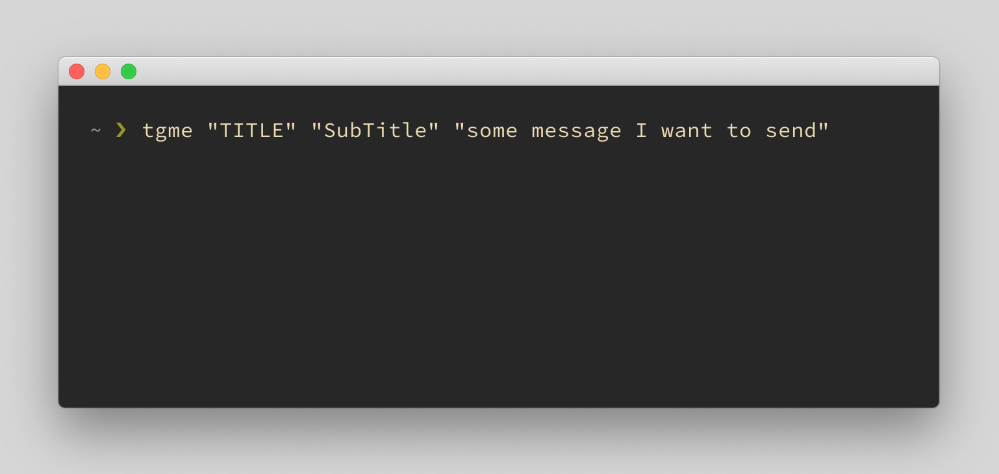

# tgme
Telegram bot written in Bash+curl to send notifications

## Rational
I have some cron jobs running and I want to be informed about the outcomes, changes and fails.
Before this bot existed, I used [Prowl](https://www.prowlapp.com/) to send notifications to my phone.
Alternative or similar solutions I had a look at are ...

- [Growl](https://github.com/growl/growl)
- [Pushover](https://pushover.net/)
- [terminal-notifier](https://github.com/julienXX/terminal-notifier)
- [alerter](https://github.com/vjeantet/alerter)
- [cocoaDialog](https://github.com/cocoadialog/cocoadialog)
- [Hammerspoon](https://www.hammerspoon.org/docs/hs.messages.html)
- [imessage](https://github.com/linjunpop/imessage)
- [libnotify](https://github.com/GNOME/libnotify) | [lnotify](https://github.com/gabrield/lnotify) | [linotify](https://github.com/hoelzro/linotify)
- osascript -e "display ..."

But I wanted to have a solution that works on my computer and phone and doesn't require installing additional apps.
And this is where Telegram comes into the game, because I'm on Telegram anyway the whole day.

## Screenshots

## Disclaimer
Use at own risc and feel free to adapt the code to your needs.
